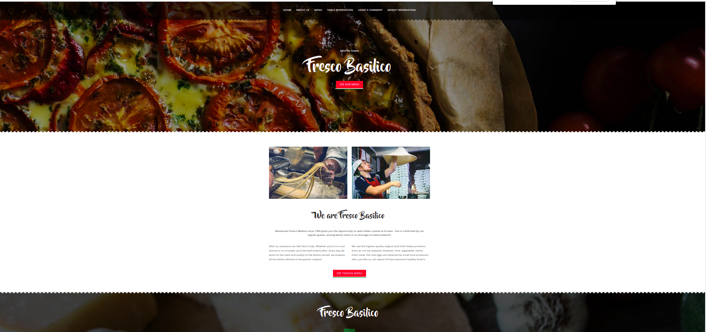
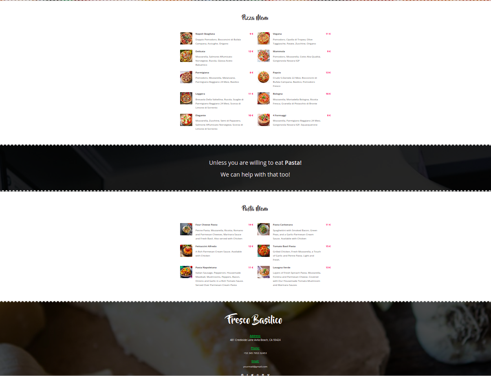
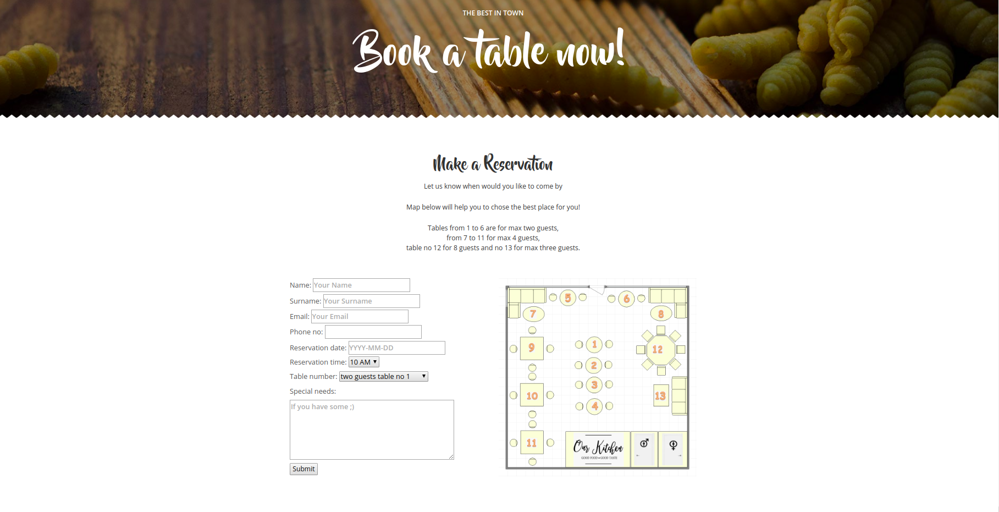
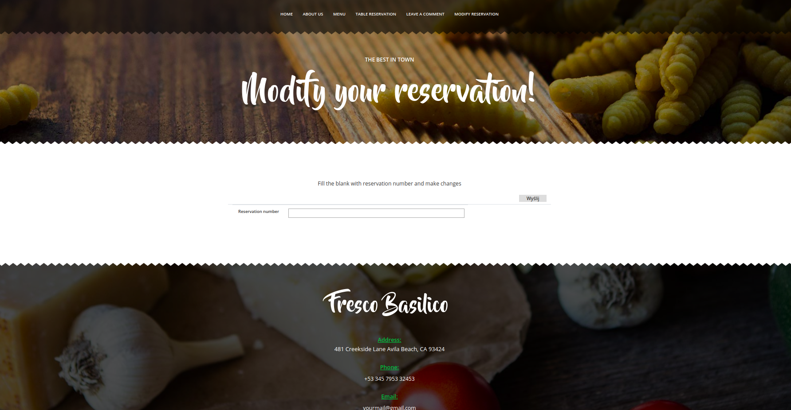

# RestaurantDjangoApp
My First Django Italian Restaurant app

## General informations
It is a simple Italian Restauration App with few functionalities. It has:
* home view with general informations
* about us view with the historical informations about the restaurant and founders family,
* meu view with all dishes,
* make a reservation view, where customer will see the whole plan of the room and can choose with place is the best for him,
* leave a comment view, where customer can share his opinion about the Restaurant,
* modify reservation view, where customer can make some changes in reservation he made befor by usinf reservation number

## Technologies
* Python 3.6.8
* Django 3.0
* PostgreSQL
* django-crispy-forms
* Bootstrap
